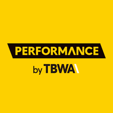
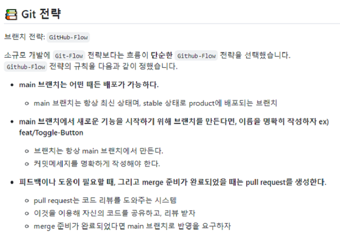
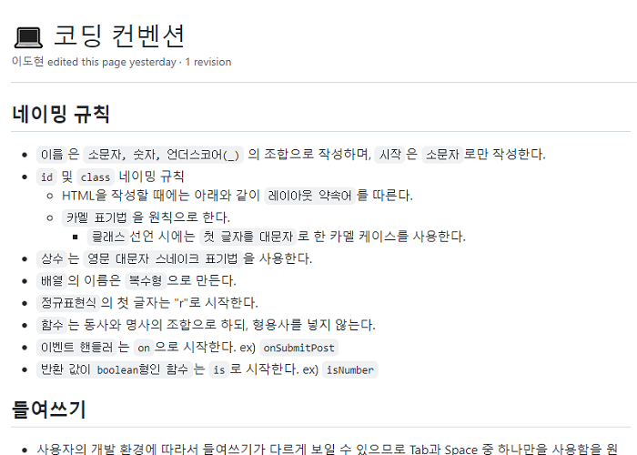

# 📝 원티드 프리 온보딩 4주차 과제 - 퍼포먼스바이 TBWA




## 📌배포 링크

- [배포링크](https://youthful-northcutt-6990e7.netlify.app/)

## 📌프로젝트 소개

- 바닐라 자바스크립트로 꾸까(https://kukka.kr/) 사이트 구현하기

## 📌기술 스택


## 📌팀원 소개

<table align="center">
<tr >
<td align="center"><a href="https://github.com/perfumelim"></a></td>
<td align="center"><a href="https://github.com/kykim00"></a></td>
<td align="center"><a href="https://github.com/ksmfou98"></a></td>
<td align="center"><a href="https://github.com/yezyvibe"></a></td>
</tr>
<tr>
<td align="center"><b> 임향수 (팀장)</b></td>
<td align="center"><b>김기영</b></td>
<td align="center"><b>이도현</b></td>
<td align="center"><b>조예지</b></td>
</tr>
<tr>
<td align="center"><b>FE Developer</b></td>
<td align="center"><b>FE Developer</b></td>
<td align="center"><b>FE Developer</b></td>
<td align="center"><b>FE Developer</b></td>
</tr>
</table>


## 📌프로젝트 과정 소개

- github-actions를 통해서 pulll request 시 assignee, reviewer를 자동 지정하도록 자동화 작업 수행하였습니다.

|     🚥Git 커밋 컨벤션 정의     |           🔰코딩 컨벤션 약속을 통한 코드 통일성           |
| :---------------------------: | :------------------------------------------------------: |
|  |  |

|           🦸‍♀️팀원 간 코드 리뷰를 통한 소통🦸‍♀️           |           🦸‍♂️팀원 간 코드 리뷰를 통한 소통🦸‍♀️           |
| :---------------------------------------------------: | :---------------------------------------------------: |
|  |  |


## 📌기능 목록 명세

### ✔ 담당자 : 김기영

- 이미지 슬라이더 구현
- 슬라이더 반응형 및 효과 적용

### ✔ 담당자 : 이도현

* 프로젝트 초기 셋팅 및 바벨 설정
* 메인 레이아웃 설정
* 타사이트 이동 시 팝업 구현

### ✔ 담당자 : 임향수

- 메인 풋터 구현
- iFrame 동영상 임베드 구현

### ✔ 담당자 : 조예지

- 메인 헤더 구현
- 이미지 배너 구현


## 📌구현 상세 내용 참고

- jQuery와 부트스트랩을 사용하지 않고 바닐라 자바스크립트로 구현하였습니다.

  

## 📌마지막 프로젝트 소감

### 👨‍💻김기영

좋은 팀원 분들과 프로젝트를 진행하면서 협업 방식과 코드 작성, 리뷰, 리팩토링 등 많은 것을 배웠던것 같습니다. 팀원 분들 모두 감사드리고 수고 많으셨습니다!!

### 👨‍💻이도현

4주 동안 팀원들이랑 여러 과제를 해왔는데, 주어진 짧은 시간 내의 팀원들과 의견을 내면서 의견을 조율하고, 문제를 해결해 나가는 과정이 정말 좋은 경험이었던 거 같습니다!
팀원분들 모두 열정이 넘치시고, 적극적으로 참여해 주셔서 정말 재밌게 과제를 했던 거 같습니다!
우리팀 모두 취업 화이팅!!

### 👩‍💻임향수

좋은 팀원들을 만나서 정말 행복했습니다 !! 덕분에 많이 배웠고 즐겁게 코딩할 수 있었어요. 팀워크는 정말 인피니트가 1등이었다고 자부합니다😎 인피니티 짱! 🥳🌟 

### 👩‍💻 조예지 
팀원들과 지난 4주 간 프로젝트를 수행하며 혼자 강의를 듣고 공부했을 때보다 더 빨리 배우고 성장할 수 있었습니다. 막히는 부분이 있었을 때 항상 열심히 알려주신 기영, 도현, 향수님에게 진심으로 감사드립니다😊 좋은 팀원분들과 함께해서 팀 프로젝트가 즐거웠습니다! 모두 멋진 프론트엔드 개발자가 되어 다시 만나면 좋겠습니다🙌 마지막으로 도멘~!


## 📌프로젝트 설치 및 시작

### 프로젝트 클론

```
$ git clone https://github.com/2201infinity/tbwa-kukka.git
```

### 패키지 설치

```
$ yarn
```

### 서버 실행

```
$ yarn run dev
```

